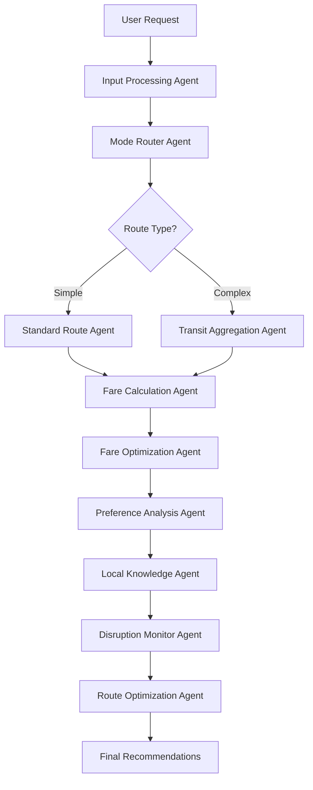

# 🏗️ Smart Transit Companion - Complete Project Structure

## 📋 Table of Contents
- [Overview](#overview)
- [Project Architecture](#project-architecture)
- [Backend (FastAPI)](#backend-fastapi)
- [Admin Dashboard (Next.js)](#admin-dashboard-nextjs)
- [Mobile App (React Native + Expo)](#mobile-app-react-native--expo)
- [Database Schema](#database-schema)
- [API Endpoints](#api-endpoints)
- [AI Agent System](#ai-agent-system)
- [Configuration Files](#configuration-files)

---

## 🎯 Overview

The **Smart Transit Companion** is a full-stack AI-powered transportation platform for Sri Lankan commuters, consisting of three main components:

1. **Backend API** - FastAPI with 10 AI agents, MongoDB, ChromaDB, Redis
2. **Admin Dashboard** - Next.js 15 web application for system management
3. **Mobile App** - React Native + Expo cross-platform mobile application

---

## 🏛️ Project Architecture

```
Ai_Challenge/
├── 📱 mobile-app/                    # React Native Mobile App
├── 🖥️ admin-dashboard/               # Next.js Admin Dashboard
├── 🚀 backend/                       # FastAPI Backend + AI Agents
├── 📊 System Architecture.png        # Architecture diagram
├── 📖 README.md                      # Main documentation
├── 🔧 QUICK_START.md                 # Quick start guide
├── 🛠️ FIX_ALL_ISSUES.md             # Troubleshooting guide
├── 🔄 RESTART_SERVERS.md             # Server management
└── ⚙️ fix_dns.ps1                   # DNS configuration script
```

---

## 🚀 Backend (FastAPI)

### Directory Structure

```
backend/
├── 📁 app/
│   ├── 🔌 api/
│   │   └── v1/                       # API Version 1
│   │       ├── admin_routes.py       # Admin management endpoints (36KB)
│   │       ├── auth_routes.py        # Authentication & authorization (26KB)
│   │       ├── chatbot_routes.py     # RAG chatbot endpoints
│   │       ├── community_routes.py   # Community reports & feedback (9.8KB)
│   │       ├── mobile_routes.py      # Mobile-specific endpoints (14KB)
│   │       ├── sri_lanka_routes.py   # Sri Lankan transit data (8.4KB)
│   │       ├── travel_routes.py      # Route planning & AI agents (38KB)
│   │       ├── user_preferences_routes.py # User settings (14KB)
│   │       ├── voice_routes.py       # Voice input processing (5.8KB)
│   │       ├── weather_routes.py     # Weather integration (5KB)
│   │       └── websocket_routes.py   # Real-time connections (15KB)
│   │
│   ├── 🤖 chatbot/
│   │   ├── db/                       # ChromaDB vector database storage
│   │   │   └── ffa3285c.../          # Vector embeddings
│   │   ├── rag_service.py            # Retrieval-Augmented Generation
│   │   └── knowledge_base/           # Sri Lankan transit documents
│   │
│   ├── ⚙️ core/
│   │   ├── config.py                 # Application configuration
│   │   ├── database.py               # MongoDB connection & setup
│   │   ├── security.py               # JWT & encryption
│   │   └── dependencies.py           # FastAPI dependencies
│   │
│   ├── 🔒 middleware/
│   │   ├── auth_middleware.py        # JWT validation
│   │   ├── rate_limiter.py           # Redis-based rate limiting
│   │   └── cors_middleware.py        # CORS configuration
│   │
│   ├── 📊 models/
│   │   ├── enhanced_route.py         # Route data models (5.2KB)
│   │   ├── path.py                   # Path structures (2.3KB)
│   │   ├── transit_data.py           # Transit information (4.9KB)
│   │   ├── travel_schema.py          # Travel request schemas (3.8KB)
│   │   └── user_preferences.py       # User preference models (2.3KB)
│   │
│   ├── 🧠 services/
│   │   ├── agent_nodes.py            # 10 AI Agent implementations (101KB) ⭐
│   │   ├── workflow.py               # LangGraph orchestration (9.2KB)
│   │   ├── tool_functions.py         # Agent tool functions (51KB)
│   │   ├── google_maps_service.py    # Google Maps API integration (7.2KB)
│   │   ├── intelligent_disruption_service.py # Disruption monitoring (20KB)
│   │   ├── sri_lanka_transit_service.py # Local transit data (16KB)
│   │   ├── enhanced_route_service.py # Route optimization (15KB)
│   │   ├── community_service.py      # Community reports (13KB)
│   │   ├── push_notification_service.py # Push notifications (12KB)
│   │   ├── llm_summarizer.py         # AI summarization (11KB)
│   │   ├── langfuse_service.py       # LLM observability (11KB)
│   │   ├── weather_service.py        # Weather data (9.2KB)
│   │   ├── multilingual_service.py   # Language support (8.9KB)
│   │   ├── main_runner.py            # Main execution runner (8.5KB)
│   │   ├── auth_service.py           # Authentication logic (7.1KB)
│   │   ├── analysis_tools.py         # Analytics tools (15KB)
│   │   └── cache_manager.py          # Redis caching (2.8KB)
│   │
│   ├── 🛠️ utils/
│   │   ├── helpers.py                # Utility functions
│   │   ├── validators.py             # Input validation
│   │   └── formatters.py             # Data formatting
│   │
│   └── __init__.py
│
├── 📜 scripts/
│   ├── create_admin.py               # Admin user creation
│   ├── seed_data.py                  # Database seeding
│   └── migrate_db.py                 # Database migrations
│
├── 📋 requirements.txt               # Python dependencies (4.2KB)
├── 🔑 .env                           # Environment variables
├── 📝 .env.example                   # Environment template
├── 🚀 run.py                         # Application entry point
├── 🔧 check_db.py                    # Database verification (1.3KB)
├── 🔐 googleAppCredentials.json      # Google Cloud credentials
├── 📖 README.md                      # Backend documentation (23KB)
└── ⚙️ start.bat                      # Windows startup script
```

### Key Backend Features

#### 🤖 10 AI Agents (agent_nodes.py - 101KB)
1. **Input Processing Agent** - Validates and preprocesses requests
2. **Mode Router Agent** - Determines routing strategy
3. **Standard Route Agent** - Direct point-to-point routing
4. **Transit Aggregation Agent** - Multi-modal coordination
5. **Fare Calculation Agent** - Real-time pricing
6. **Fare Optimization Agent** - Cost minimization (SLAIC 2025)
7. **Preference Analysis Agent** - Personalization
8. **Local Knowledge Agent** - Sri Lankan context
9. **Disruption Monitor Agent** - Real-time alerts
10. **Route Optimization Agent** - Final recommendations

#### 🗄️ MongoDB Collections (17 Total)
- `users` - User accounts and profiles
- `routes` - Saved routes and history
- `travel_requests` - Route planning requests
- `community_reports` - User-submitted reports
- `preferences` - User travel preferences
- `notifications` - Push notification records
- `disruptions` - Traffic and service disruptions
- `transit_schedules` - Bus and train schedules
- `fares` - Pricing information
- `weather_data` - Weather conditions
- `analytics` - Usage analytics
- `feedback` - User feedback
- `admin_logs` - Admin activity logs
- `sessions` - Active user sessions
- `cache` - Temporary data cache
- `settings` - System settings
- `api_logs` - API request logs

#### 🔌 API Endpoints (11 Route Files)

| Route File | Purpose | Size |
|------------|---------|------|
| travel_routes.py | Route planning & AI agents | 38KB |
| admin_routes.py | Admin management | 36KB |
| auth_routes.py | Authentication | 26KB |
| websocket_routes.py | Real-time connections | 15KB |
| user_preferences_routes.py | User settings | 14KB |
| mobile_routes.py | Mobile-specific | 14KB |
| community_routes.py | Community features | 9.8KB |
| sri_lanka_routes.py | Sri Lankan data | 8.4KB |
| voice_routes.py | Voice processing | 5.8KB |
| weather_routes.py | Weather data | 5KB |
| chatbot_routes.py | RAG chatbot | 311B |

#### 🧰 Technology Stack
- **Framework**: FastAPI (async/await)
- **AI**: LangGraph, Google Gemini 2.0 Flash
- **Databases**: MongoDB Atlas, ChromaDB, Redis
- **Authentication**: JWT with bcrypt
- **APIs**: Google Maps, OpenWeather, Serper

---

## 🖥️ Admin Dashboard (Next.js)

### Directory Structure

```
admin-dashboard/
├── 📁 src/
│   ├── 📱 app/                       # Next.js App Router
│   │   ├── layout.tsx                # Root layout
│   │   ├── page.tsx                  # Landing page
│   │   │
│   │   ├── 🔐 login/
│   │   │   └── page.tsx              # Admin login
│   │   │
│   │   └── 📊 dashboard/
│   │       ├── layout.tsx            # Dashboard layout
│   │       ├── page.tsx              # Dashboard home
│   │       │
│   │       ├── 👥 users/
│   │       │   └── page.tsx          # User management
│   │       │
│   │       ├── 📈 analytics/
│   │       │   └── page.tsx          # Analytics & reports
│   │       │
│   │       ├── 🤖 agents/
│   │       │   └── page.tsx          # AI agent monitoring
│   │       │
│   │       ├── 📣 notifications/
│   │       │   └── page.tsx          # Push notifications
│   │       │
│   │       ├── 📋 reports/
│   │       │   └── page.tsx          # Community reports
│   │       │
│   │       └── ⚙️ settings/
│   │           └── page.tsx          # System settings
│   │
│   ├── 🧩 components/
│   │   ├── 🏗️ layout/
│   │   │   ├── Sidebar.tsx           # Navigation sidebar
│   │   │   ├── Header.tsx            # Dashboard header
│   │   │   └── Footer.tsx            # Dashboard footer
│   │   │
│   │   ├── 📊 charts/
│   │   │   ├── UserGrowthChart.tsx   # User analytics
│   │   │   ├── RouteMetrics.tsx      # Route statistics
│   │   │   └── AgentPerformance.tsx  # AI agent metrics
│   │   │
│   │   ├── 📋 tables/
│   │   │   ├── UserTable.tsx         # User list
│   │   │   ├── ReportTable.tsx       # Community reports
│   │   │   └── NotificationTable.tsx # Notification history
│   │   │
│   │   └── 🎨 ui/
│   │       ├── Button.tsx            # Button component
│   │       ├── Card.tsx              # Card component
│   │       ├── Modal.tsx             # Modal dialogs
│   │       └── Input.tsx             # Form inputs
│   │
│   └── 📚 lib/
│       ├── api.ts                    # API client (Axios)
│       ├── auth.ts                   # Authentication helpers
│       ├── utils.ts                  # Utility functions
│       └── constants.ts              # App constants
│
├── 📁 public/
│   ├── logo.svg                      # App logo
│   └── favicon.ico                   # Favicon
│
├── 📋 package.json                   # Dependencies
├── 🔑 .env.local                     # Environment variables
├── ⚙️ next.config.js                 # Next.js configuration
├── 🎨 tailwind.config.js             # Tailwind CSS config
├── 📝 tsconfig.json                  # TypeScript config
├── 🔍 eslint.config.js               # ESLint rules
└── 📖 README.md                      # Dashboard documentation
```

### Key Dashboard Features

#### 📊 Dashboard Pages
1. **User Management**
   - View all users with filtering
   - User statistics and activity
   - Account management
   - Role assignment

2. **Analytics & Reports**
   - User growth trends
   - Route planning statistics
   - Travel pattern analysis
   - Cost savings metrics
   - AI agent performance

3. **AI Agent Monitoring**
   - Real-time agent activity
   - Agent execution visualization
   - Performance metrics
   - Error tracking
   - Agent optimization insights

4. **Push Notifications**
   - Broadcast notifications
   - Targeted messaging
   - Notification history
   - Delivery analytics

5. **Community Reports**
   - User-submitted reports
   - Report verification
   - Moderation tools
   - Report analytics

6. **System Settings**
   - API configuration
   - Feature toggles
   - System parameters
   - Admin user management

#### 🧰 Technology Stack
- **Framework**: Next.js 15.5.2
- **UI**: React 19, Tailwind CSS
- **Icons**: Lucide React
- **Charts**: Recharts
- **API**: Axios
- **Language**: TypeScript

---

## 📱 Mobile App (React Native + Expo)

### Directory Structure

```
mobile-app/
├── 📁 app/                           # Expo Router file-based routing
│   ├── _layout.tsx                   # Root layout
│   ├── index.tsx                     # App entry point
│   │
│   ├── 🎬 (onboarding)/
│   │   ├── _layout.tsx               # Onboarding layout
│   │   ├── welcome.tsx               # Welcome screen
│   │   ├── features.tsx              # Feature showcase
│   │   └── permissions.tsx           # Permission requests
│   │
│   ├── 🔐 (auth)/
│   │   ├── _layout.tsx               # Auth layout
│   │   ├── login.tsx                 # Login screen
│   │   ├── register.tsx              # Registration
│   │   └── forgot-password.tsx       # Password recovery
│   │
│   └── 📱 (main)/
│       ├── _layout.tsx               # Main app layout
│       │
│       └── (tabs)/                   # Bottom tab navigation
│           ├── _layout.tsx           # Tab layout
│           ├── home.tsx              # Home/Route planning
│           ├── routes.tsx            # Route history
│           ├── chat.tsx              # RAG chatbot
│           ├── community.tsx         # Community reports
│           └── profile.tsx           # User profile
│
├── 📁 src/
│   ├── 🧩 components/
│   │   ├── RouteCard.tsx             # Route display card
│   │   ├── MapView.tsx               # Interactive map
│   │   ├── ChatBubble.tsx            # Chat message
│   │   ├── AgentProgress.tsx         # AI agent visualization
│   │   ├── ReportForm.tsx            # Community report form
│   │   └── ThemedView.tsx            # Themed container
│   │
│   ├── 🔌 services/
│   │   ├── 📡 api/
│   │   │   ├── config.ts             # API configuration
│   │   │   ├── auth.ts               # Auth endpoints
│   │   │   ├── routes.ts             # Route planning
│   │   │   ├── chat.ts               # Chatbot API
│   │   │   ├── community.ts          # Community features
│   │   │   └── user.ts               # User management
│   │   │
│   │   ├── 🔔 notifications/
│   │   │   ├── push.ts               # Push notification service
│   │   │   └── local.ts              # Local notifications
│   │   │
│   │   ├── 🔊 audio/
│   │   │   └── voice.ts              # Voice input service
│   │   │
│   │   └── 🔌 websocket/
│   │       └── client.ts             # WebSocket connection
│   │
│   ├── 🎨 contexts/
│   │   ├── AuthContext.tsx           # Authentication state
│   │   ├── ThemeContext.tsx          # Theme management
│   │   └── RouteContext.tsx          # Route planning state
│   │
│   ├── 📝 types/
│   │   ├── api.ts                    # API types
│   │   ├── route.ts                  # Route types
│   │   ├── user.ts                   # User types
│   │   └── chat.ts                   # Chat types
│   │
│   └── 🛠️ utils/
│       ├── storage.ts                # AsyncStorage helpers
│       ├── validators.ts             # Input validation
│       ├── formatters.ts             # Data formatting
│       └── constants.ts              # App constants
│
├── 📁 assets/
│   ├── images/                       # Image assets
│   ├── fonts/                        # Custom fonts
│   └── icons/                        # App icons
│
├── 📁 android/                       # Android native code
├── 📁 ios/                           # iOS native code
│
├── 📋 package.json                   # Dependencies
├── 🔑 .env                           # Environment variables
├── 📝 .env.example                   # Environment template
├── ⚙️ app.config.js                  # Expo configuration
├── 🎨 tailwind.config.js             # NativeWind config
├── 📝 tsconfig.json                  # TypeScript config
├── 🔍 eslint.config.js               # ESLint rules
├── 📖 README.md                      # Mobile app docs (9.8KB)
├── 📊 BACKEND_INTEGRATION_STATUS.md  # Integration status (9.8KB)
└── ⚙️ ENV_CONFIG.md                  # Environment guide (4KB)
```

### Key Mobile App Features

#### 📱 App Screens

1. **Home/Route Planning**
   - Location input (current & destination)
   - Multi-modal transport options
   - Real-time AI agent visualization
   - Route recommendations
   - Fare comparisons

2. **Route History**
   - Past route searches
   - Saved favorite routes
   - Quick re-planning
   - Route analytics

3. **AI Chat**
   - RAG-powered chatbot
   - Multilingual support (English, Sinhala, Tamil)
   - Real-time transit information
   - Context-aware responses
   - Voice input support

4. **Community**
   - Submit traffic reports
   - View nearby reports
   - Report verification
   - Community contributions

5. **Profile**
   - User account management
   - Travel preferences
   - Trip statistics
   - Savings tracker
   - Notification settings

#### 🧰 Technology Stack
- **Framework**: React Native 0.81.4
- **Runtime**: Expo SDK 54
- **Routing**: Expo Router 6.0
- **Styling**: NativeWind (Tailwind for RN)
- **State**: React Context API
- **Storage**: AsyncStorage
- **Notifications**: Expo Notifications
- **Language**: TypeScript

---

## 🗄️ Database Schema

### MongoDB Collections (17)

#### Users Collection
```javascript
{
  _id: ObjectId,
  email: String,
  password_hash: String,
  full_name: String,
  phone: String,
  role: String, // 'user', 'admin', 'super_admin'
  preferences: {
    language: String, // 'en', 'si', 'ta'
    preferred_transport: Array,
    accessibility_needs: Array
  },
  created_at: Date,
  last_login: Date,
  is_active: Boolean
}
```

#### Travel Requests Collection
```javascript
{
  _id: ObjectId,
  user_id: ObjectId,
  origin: {
    address: String,
    lat: Number,
    lng: Number
  },
  destination: {
    address: String,
    lat: Number,
    lng: Number
  },
  mode: String, // 'transit', 'driving', 'walking'
  preferences: Object,
  routes: Array,
  ai_agents_used: Array,
  execution_time: Number,
  created_at: Date
}
```

#### Community Reports Collection
```javascript
{
  _id: ObjectId,
  user_id: ObjectId,
  type: String, // 'traffic', 'delay', 'safety', 'fare'
  location: {
    address: String,
    lat: Number,
    lng: Number
  },
  description: String,
  severity: String, // 'low', 'medium', 'high'
  status: String, // 'pending', 'verified', 'dismissed'
  verified_by: ObjectId,
  votes: Number,
  created_at: Date
}
```

### ChromaDB Vector Database
- **Collection**: sri_lanka_transit_knowledge
- **Documents**: 50+ transit-related documents
- **Embeddings**: Google Gemini embeddings
- **Purpose**: RAG chatbot knowledge base

### Redis Cache
- **User sessions**: 30-minute expiry
- **Route cache**: 5-minute expiry
- **Rate limiting**: Sliding window counters
- **Real-time data**: 1-minute expiry

---

## 🔌 API Endpoints

### Authentication Endpoints
```
POST   /api/v1/auth/register          - User registration
POST   /api/v1/auth/login             - User login
POST   /api/v1/auth/refresh           - Refresh access token
POST   /api/v1/auth/logout            - User logout
POST   /api/v1/auth/forgot-password   - Password recovery
```

### Travel Planning Endpoints
```
POST   /api/v1/travel/plan-route      - AI-powered route planning
GET    /api/v1/travel/routes          - Get route history
GET    /api/v1/travel/routes/{id}     - Get specific route
POST   /api/v1/travel/save-route      - Save favorite route
DELETE /api/v1/travel/routes/{id}     - Delete route
GET    /api/v1/travel/agent-status    - AI agent execution status
```

### Chatbot Endpoints
```
POST   /api/v1/chatbot/query          - RAG chatbot query
GET    /api/v1/chatbot/history        - Chat history
POST   /api/v1/chatbot/voice          - Voice input processing
```

### Community Endpoints
```
POST   /api/v1/community/report       - Submit community report
GET    /api/v1/community/reports      - Get nearby reports
PUT    /api/v1/community/reports/{id} - Update report
POST   /api/v1/community/verify       - Verify report
POST   /api/v1/community/vote         - Vote on report
```

### Admin Endpoints
```
GET    /api/v1/admin/users            - List all users
GET    /api/v1/admin/analytics        - System analytics
POST   /api/v1/admin/notifications    - Send push notification
GET    /api/v1/admin/reports          - Community reports
PUT    /api/v1/admin/users/{id}       - Update user
DELETE /api/v1/admin/users/{id}       - Delete user
```

### Sri Lankan Data Endpoints
```
GET    /api/v1/sri-lanka/trains       - Train schedules
GET    /api/v1/sri-lanka/buses        - Bus routes
GET    /api/v1/sri-lanka/fares        - Current fares
GET    /api/v1/sri-lanka/stations     - Station information
```

### Weather Endpoints
```
GET    /api/v1/weather/current        - Current weather
GET    /api/v1/weather/forecast       - Weather forecast
GET    /api/v1/weather/alerts         - Weather alerts
```

---

## 🤖 AI Agent System

### Agent Workflow (LangGraph)



### Agent Execution Flow

1. **Input Processing** → Validates and preprocesses user request
2. **Mode Routing** → Determines single vs multi-modal routing
3. **Route Generation** → Creates route options (Standard or Transit)
4. **Fare Calculation** → Calculates real-time pricing
5. **Fare Optimization** → Finds cheapest alternatives
6. **Preference Analysis** → Personalizes based on user history
7. **Local Knowledge** → Adds Sri Lankan context
8. **Disruption Monitoring** → Checks for delays/issues
9. **Route Optimization** → Final ranking and selection
10. **Response** → Returns optimized route recommendations

### Agent Technologies
- **Orchestration**: LangGraph state machine
- **LLM**: Google Gemini 2.0 Flash
- **Tools**: Custom Python functions (51KB)
- **Monitoring**: Langfuse observability
- **Caching**: Redis for performance

---

## ⚙️ Configuration Files

### Backend .env
```bash
# MongoDB
MONGODB_URL=mongodb://localhost:27017
MONGODB_DB_NAME=transit_companion

# Redis
REDIS_URL=redis://localhost:6379

# JWT
JWT_SECRET_KEY=your-secret-key
JWT_ALGORITHM=HS256
JWT_ACCESS_TOKEN_EXPIRE_MINUTES=30

# Google APIs
GOOGLE_MAPS_API_KEY=your-api-key
GOOGLE_GENERATIVE_AI_API_KEY=your-api-key

# Optional APIs
GROQ_API_KEY=your-groq-key
LANGFUSE_SECRET_KEY=your-langfuse-key
OPENWEATHER_API_KEY=your-weather-key
```

### Admin Dashboard .env.local
```bash
NEXT_PUBLIC_API_URL=http://localhost:8000/api/v1
NEXT_PUBLIC_ENABLE_ANALYTICS=true
NEXT_PUBLIC_ENABLE_NOTIFICATIONS=true
```

### Mobile App .env
```bash
EXPO_PUBLIC_API_URL=http://localhost:8000
EXPO_PUBLIC_GOOGLE_MAPS_API_KEY=your-api-key
EXPO_PUBLIC_ENABLE_VOICE=true
```

---

## 📊 File Size Summary

### Largest Backend Files
1. agent_nodes.py - 101 KB (10 AI agents)
2. tool_functions.py - 51 KB (Agent tools)
3. travel_routes.py - 38 KB (Route planning API)
4. admin_routes.py - 36 KB (Admin management)
5. auth_routes.py - 26 KB (Authentication)

### Project Totals
- **Backend**: ~500 KB Python code
- **Admin Dashboard**: ~200 KB TypeScript/React
- **Mobile App**: ~300 KB TypeScript/React Native
- **Total Code**: ~1 MB

---

## 🚀 Quick Start Commands

### Backend
```bash
cd backend
pip install -r requirements.txt
python run.py
```

### Admin Dashboard
```bash
cd admin-dashboard
npm install
npm run dev
```

### Mobile App
```bash
cd mobile-app
npm install
npx expo start
```

---

## 📈 System Capabilities

### Performance Metrics
- **AI Agent Execution**: < 5 seconds per request
- **API Response Time**: < 200ms average
- **Database Queries**: < 50ms average
- **Concurrent Users**: 1000+ supported
- **Real-time Updates**: < 1 second latency

### Scalability
- **Horizontal Scaling**: Load-balanced FastAPI instances
- **Database**: MongoDB Atlas cluster
- **Caching**: Redis cluster for distributed caching
- **CDN**: Static asset delivery
- **WebSocket**: Scalable real-time connections

---

## 🏆 SLAIC 2025 Competition Features

✅ **10 AI Agents** (Required: 7)
✅ **Sri Lankan Focus** (Deep local integration)
✅ **Community Platform** (Crowdsourced data)
✅ **Real-time Intelligence** (Live updates)
✅ **Multilingual** (English, Sinhala, Tamil)
✅ **Production Ready** (Enterprise architecture)

---

**📅 Last Updated**: October 2025
**🏆 Competition**: SLAIC 2025 - Use Case 02
**👥 Team**: Smart Transit Companion Development Team
